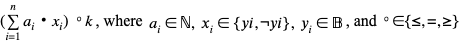
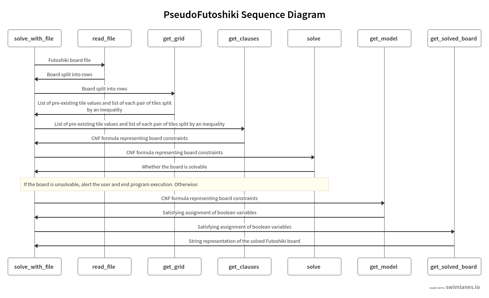

# PseudoFutoshiki

PseudoFutoshiki is a lightweight Futoshiki solver that makes use of pseudo-boolean formulae and a modern SAT solver to compute the solvability of a given game board.

## Description

PseudoFutoshiki seeks to expand upon the work that others have done in the realm of solving logic puzzles using SAT solvers by making use of pseudo-boolean encodings. Pseudo-boolean encodings allow mathematical relations in the following form to be encoded in a boolean CNF formula:



So, by taking advantage of the mathematical underpinnings of Futoshiki (in the form of Latin squares), pseudo-boolean encodings enable the development of clean, digestible, and unambiguous code. They also allow additional mathematical constraints to be put on the board with ease.

The following is a sequence diagram depicting the algorithm's execution path. The solve and get_model methods come from the PySAT library, but the rest are home-grown.

## Getting Started

### Installing

1. Clone the repository or download the source code to your local machine
2. Run the following command to install the necessary library dependencies ([PySAT](https://pysathq.github.io/) and [PyPBLib](https://pypi.org/project/pypblib/))
```
pip3 install -r requirements.txt
```

### Executing program

1. Choose one of the prebuilt boards found in the boards folder or create your own board following the style of the prebuilt boards
2. Run main.py with the filepath of your desired board as the sole argument.

Ex.
```
python3 main.py boards/grid2_val.txt
```

## Authors & Contact
* Sean Kelly - [@se-ke](https://github.com/se-ke)
* Dylan Huang - [@huangdylan08](https://github.com/huangdylan08)

## License

This project is licensed under the MIT License - see the [LICENSE](LICENSE) file for details

## Acknowledgments

* Professor Jason Hemann introduced us to the world of (un)satisfiability in our CS2800 class during the Fall 2020 semester
* mattismegevand's [Futoshiki SAT solver](https://github.com/mattismegevand/sat-futoshiki) served as a foundation for this project and helped us to identify what has already been done in terms of Futoshiki SAT solvers
* Martin Hořeňovský's article on [modern SAT solvers](https://codingnest.com/modern-sat-solvers-fast-neat-underused-part-1-of-n/) taught us a lot about how to encode games in boolean logic